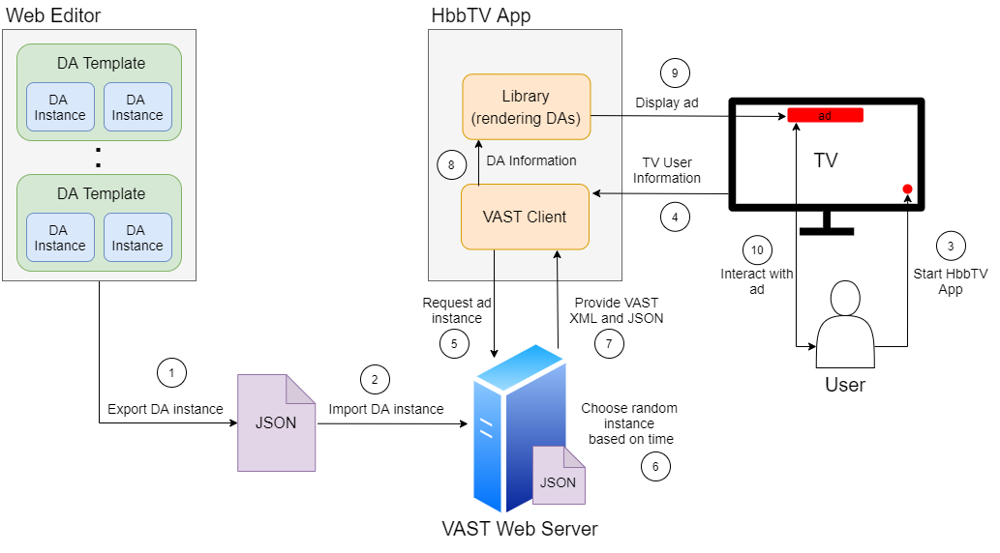
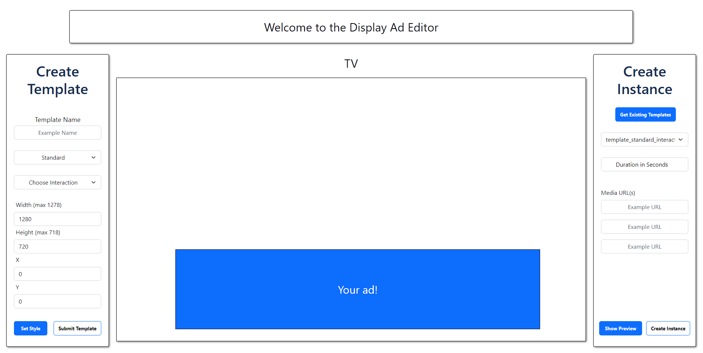

# Interactive Display Ads for HbbTV

Create customized display ads for an HbbTV application.

## Documentation

The underlying concept of our architecture:

Preview of our web-editor:

## Getting Started

Prerequisites:
- Preinstalled emulator on your browser (like HybridTV Dev Environment or Hybrid TV viewer)
- Node package manager installed

1. Download or clone our repository
2. Go to awt-da-editor and run: npm install
3. Go to awt-da-webserver and run: npm install
4. Start the editor and the webserver with: npm start
5. Go to awt-da-app and run the HTML file in chrome or firefox

## Disclaimer

This prototype is developed in context of the *Master Project: Advanced Web Technologies* at the TU Berlin
in the winter term 2022/23.

